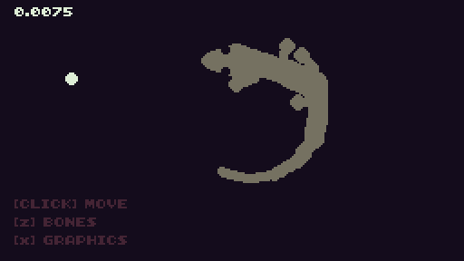

# Gecko

> Gecko locomotion / FK & IK demo

### Reference
 - [RujiK's procedural Salamander](https://twitter.com/TheRujiK/status/969581641680195585)
 - [Sean's FABRIK Algorithm blog post](https://sean.cm/a/fabrik-algorithm-2d)

### TODO
 - bone angle constraint
